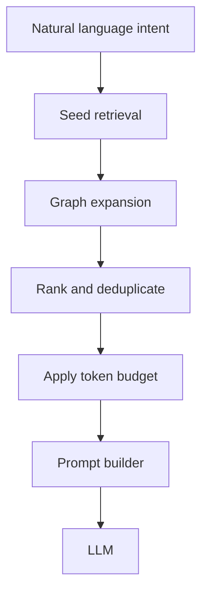

# Taproot — Engineering Intelligence Engine

Determinism-first repository analysis and context retrieval for AI coding assistants. Taproot builds a structural model of a TypeScript codebase, retrieves only the files relevant to a natural-language task, and assembles a token-budgeted prompt before any LLM is invoked.

Most coding assistants dump the open file, nearby imports, or a semantic search top-k into the prompt. That wastes tokens, invites hallucinated edits in unrelated files, and gives you no way to measure whether the context was actually right. Taproot answers a narrower, more useful question: **given a task description, which files should the model see?**

---

## Problem

When an AI assistant receives too much repository context:

- **Token cost scales with repo size**, not task relevance
- **Hallucinated cross-file edits** increase when unrelated modules appear in context
- **No feedback loop** — you cannot tell if retrieval picked the right files

---

## Solution

Taproot runs a fixed pipeline before any LLM call:



1. **Scan** — walk the repo, extract symbols, components, entities, import/call graphs
2. **Retrieve** — match query tokens against a repository vocabulary (components, symbols, filenames, graph neighbors)
3. **Rank & optimize** — aggregate scores per file, penalize barrel files, deduplicate
4. **Budget** — cap output to 8 files / ~7k tokens (what the user actually sees)
5. **Prompt** — inject source snippets for selected files only

The same budget output feeds both the CLI/VS Code demo and the evaluation harness, so measured precision/recall reflect what users get.

---

## Quick start

```bash
pnpm install
pnpm build

# Analyze a repository
node apps/cli/dist/index.js inspect .

# Retrieve context for a task (no LLM required)
node apps/cli/dist/index.js context . "add confidence scoring to retrieval"

# Full pipeline with LLM answer (requires ANTHROPIC_API_KEY or GEMINI_API_KEY in .env)
node apps/cli/dist/index.js context . "explain the evaluation pipeline"

# Backtest retrieval against git history
node apps/cli/dist/index.js evaluate .
```

Set API keys in `.env` at the repo root:

```
ANTHROPIC_API_KEY=sk-...
GEMINI_API_KEY=...
```

---

## CLI commands

| Command | Description |
|---------|-------------|
| `inspect` / `scan` | Build repository model, print symbol/component counts |
| `context <repo> <query>` | Run retrieval → rank → budget → prompt (optional LLM) |
| `evaluate <repo>` | Score retrieval against recent git commits |
| `search`, `impact`, `explain`, `risk` | Query the knowledge graph |
| `components`, `calls`, `graph` | Inspect structure |

---

## VS Code extension

The `taproot-vscode` extension exposes **Engineering Context** as a command palette action. It runs the same `buildContext` pipeline and renders selected files, confidence score, and the assembled prompt in a webview panel.

---

## Evaluation

Evaluation measures how well the **final budget output** (post-`rankContext` / `optimize` / `applyBudget`) aligns with files actually changed in each commit. Changed files are a proxy for ground-truth relevance.

| Metric | Meaning |
|--------|---------|
| **Precision** | Share of selected files that were actually changed |
| **Recall** | Share of changed files that were selected |
| **F1** | Harmonic mean of precision and recall |

Commits are filtered with `commitFilter.ts` — merges, formatting, lint, dependency bumps, and large diffs (>20 files) are excluded so scores reflect feature/fix work.

### Empirical Benchmark Results

Run with `taproot evaluate <repo>` (or `node apps/cli/dist/index.js evaluate <repo>`) after `pnpm build`.

#### Taproot Repository (Self-Evaluation Benchmark)

| Commits evaluated | Precision | Recall | F1 |
|-------------------|-----------|--------|-----|
| 7 | **0.46** | **0.41** | **0.42** |

Evaluated commits include `feat(retrieval): implement deterministic seed retrieval engine`, `feat(context): implement context optimization engine`, `feat(evaluation): evaluate retrieval using git history`, and similar conventional feature work where commit messages name the targeted subsystems.

#### tRPC Monorepo Benchmark (`trpc/trpc`)

| Commits evaluated | Precision | Recall | F1 |
|-------------------|-----------|--------|-----|
| 19 | **0.06** | **0.14** | **0.07** |

#### Zustand State Engine Benchmark (`pmndrs/zustand`)

| Commits evaluated | Precision | Recall | F1 |
|-------------------|-----------|--------|-----|
| 29 | **0.00** | **0.02** | **0.01** |

---

## Architecture

```
packages/
  analyzer/    TypeScript AST walk — symbols, components, entities, graphs
  core/        Retrieval, context budget, evaluation, reasoning, cache
  observer/    File discovery and repo snapshot
  config/      Per-repo configuration
  providers/   LLM adapters (Anthropic, Gemini)
apps/
  cli/         `taproot` command-line tool
  vscode/      VS Code extension
```

Key design choices:

- **Deterministic retrieval** — same query + same repo always yields the same file set; no embedding drift
- **Graph expansion** — seed matches propagate along import and call edges
- **Confidence gating** — LOW-confidence queries are rejected before an LLM is called
- **Disk cache** — analyzed models persist in `.taproot-cache.json` (gitignored)

---

## Current limitations

- TypeScript only
- Conventional naming helps (kebab-case files, NestJS decorators, barrel detection)
- Deterministic token matching — embedding/hybrid retrieval planned for v2
- Evaluation window is the last 30 commits by default

---

## Roadmap

- Hybrid retrieval (deterministic + embeddings)
- Git history weighting for ranking
- Multi-language support
- Plugin SDK for custom vocabulary sources

---

## Development

```bash
pnpm test          # vitest
pnpm coverage      # coverage report
pnpm lint          # eslint
```

Monorepo managed with **pnpm workspaces** and **Turborepo**.

---

## License

MIT
